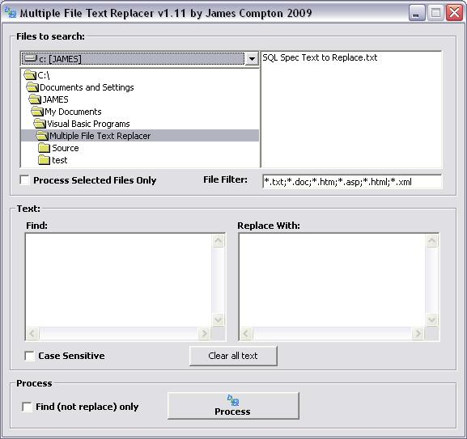



## Replace Text in Multiple Files at once

### Description

Multiple Files Text Replacer

This simple program allows you to select a folder and file filter, then replace a string in all the selected files with another string. Simple as that!

It has been updated on 20-01-2009 to include additional features:

- Can now choose to only search files that have been selected in the file list (thanks Rde!)

- Displays a list of all changed files

- Gives option to select files changed in file list box

- Can 'Find Only' - ie. Don't replace text, just show a list of files found
 
### More Info
 

             |
---                |---
**Submitted On**   |2009-01-06 11:01:26
**By**             |[Jimbobslimbob](https://github.com/Planet-Source-Code/PSCIndex/blob/master/ByAuthor/jimbobslimbob.md)
**Level**          |Beginner
**User Rating**    |4.7 (14 globes from 3 users)
**Compatibility**  |VB 6\.0
**Category**       |[String Manipulation](https://github.com/Planet-Source-Code/PSCIndex/blob/master/ByCategory/string-manipulation__1-5.md)
**World**          |[Visual Basic](https://github.com/Planet-Source-Code/PSCIndex/blob/master/ByWorld/visual-basic.md)
**Archive File**   |[Replace\_Te2141121222009\.zip](https://github.com/Planet-Source-Code/jimbobslimbob-replace-text-in-multiple-files-at-once__1-71616/archive/master.zip)

